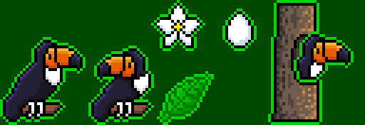
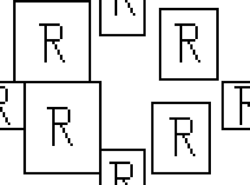
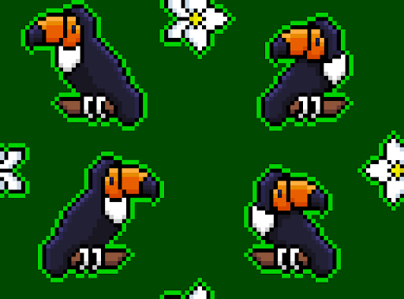
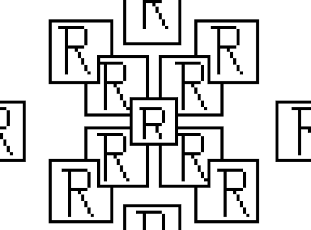
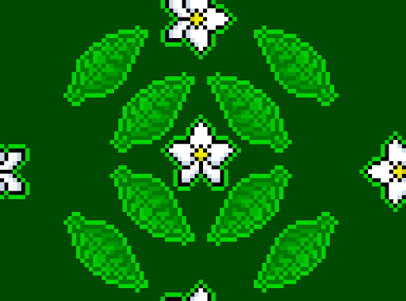
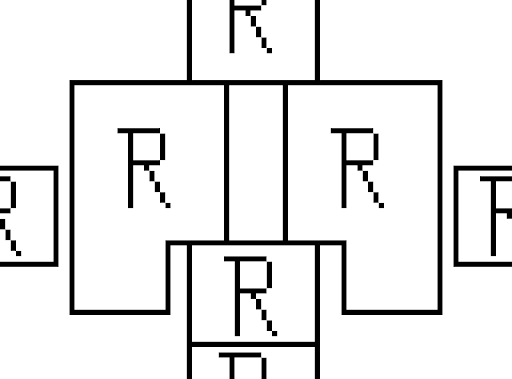
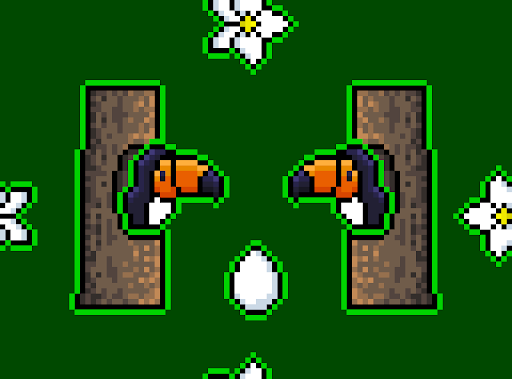
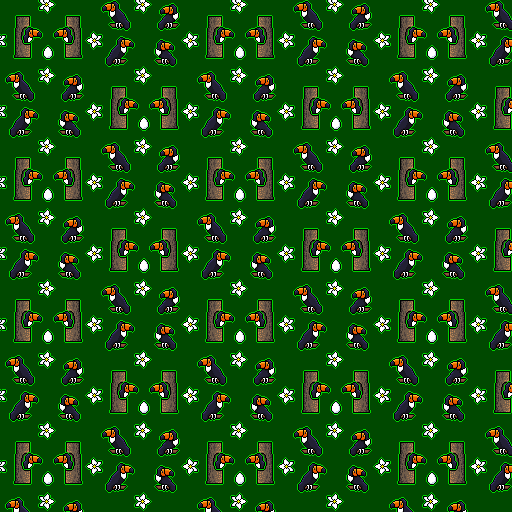
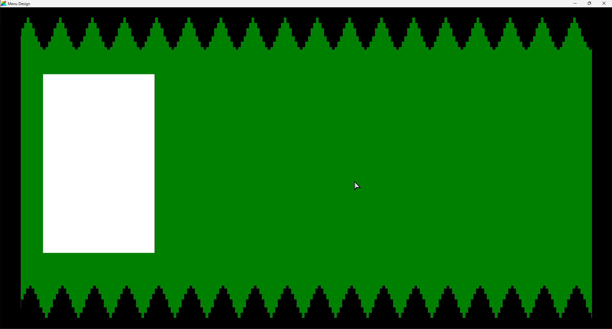
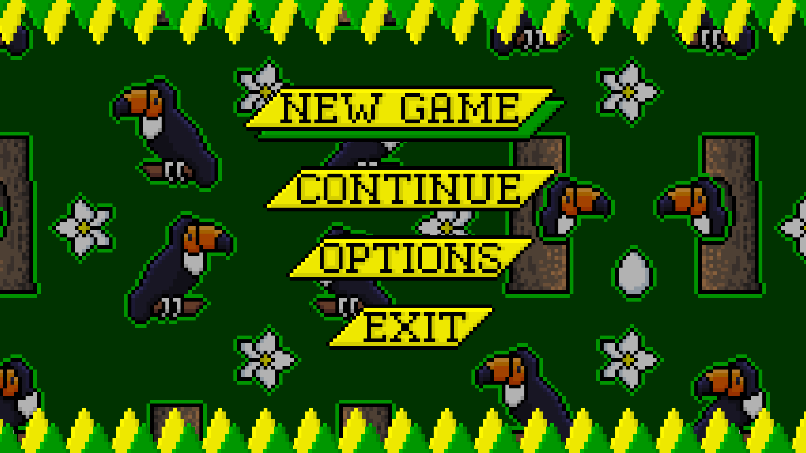

# Surface Design

This is a college project in which we had to create a surface design pattern for a product. The theme for the pattern was "Brazil", be it's culture or nature. The product choosen was a game main menu, while the toucan was the chosen animal for the pattern.

## Project Development

 ***
 ### Index:
 #### 1. [Pattern](#pattern)
 #### 2. [Final Result](#product)
 ***

#### 1. Pattern
After the theme and product were chosen, the first step was to look for references, and research the theme. After that, we defined the color palette and the style of the pattern, leading to the creation of this sketch:

Then, we started to make the pattern, first we created the main elements that would go in it.

Second, we defined the positioning of these elements. Creating tree different versions of the pattern.

##### Pattern 1

 

##### Pattern 2

 

##### Pattern 3

 

Finally, we created the final pattern, merging pattern 1 and pattern 3 into a single image.

#### 2. Product
With the pattern done, we created the main menu for the game. First, we made a simple prototype that could be used as a base for the final product.

The prototype version of this repository can be found [here](https://github.com/F3rnDev/Surface-Design/releases/tag/Prototypes).

The white rectangle is ment to be where the menu options would be, while the toucan pattern would be the green background.

From there, we developed the final version of the main menu, using the pattern as the background and adding the menu options.

